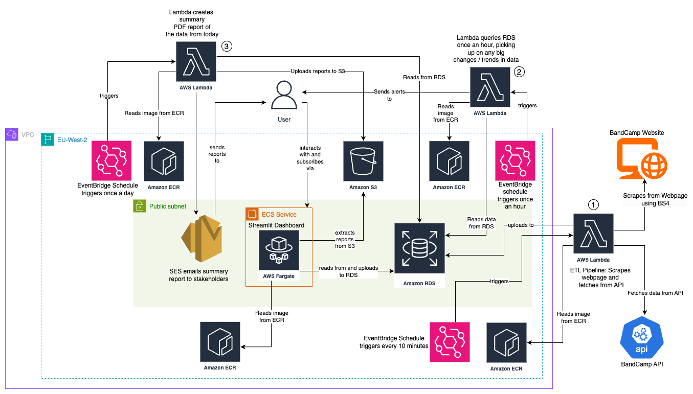
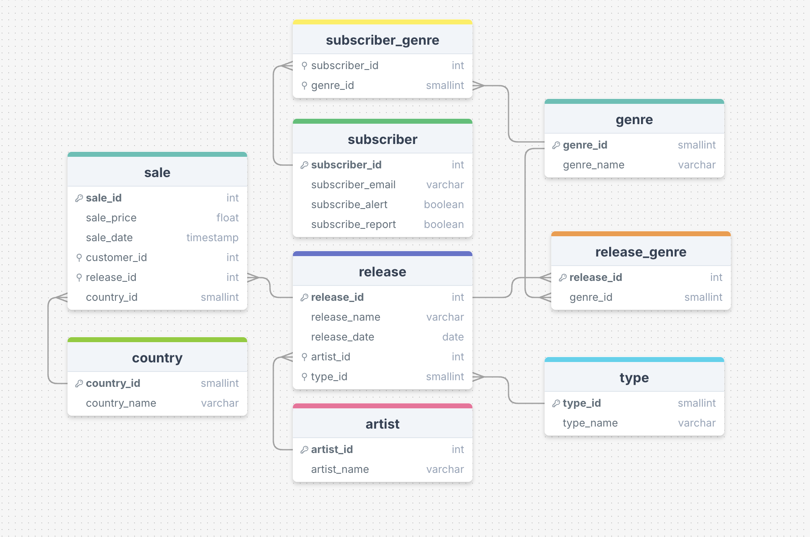
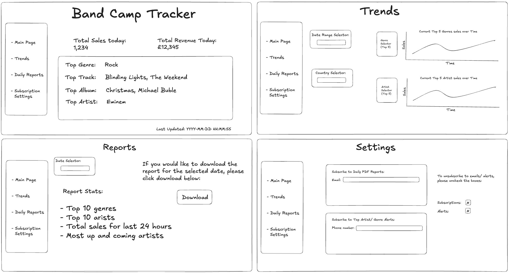

# **Band Scout Project**

---

## **Overview**

Our **Band Scout Project** is a data-driven project designed to provide insights into trending genres and artists in the music industry. By addressing the challenges of identifying trends in a fragmented and complex market, this project helps uncover what genres are popular and which artists are gaining traction before they become mainstream.

The solution regularly collects and processes sales and genre data from the BandCamp platform, presenting it via a dashboard and automated reports and alerts. 

---

## **Architecture**

The architecture of this project consists of:
1. **Data Extraction**: Using the BandCamp API and web scraping with Beautiful Soup to gather data.
2. **Data Transformation**: Cleaning and standardising the extracted data.
3. **Data Storage**: Storing all data in Amazon RDS for querying and reporting.
4. **Dashboard**: A Streamlit-based dashboard hosted on ECS for real-time data visualisation.
5. **Reports**: Automated daily PDF reports detailing sales trends and performance metrics.
6. **Alerts**: Notifications for key trends triggered by changes in data, implemented via AWS Lambda.
7. **Automation**: EventBridge triggers and Lambda functions to schedule and manage workflows.

Refer to the **[Architecture Diagram](./docs/architecture-diagram.png)** for a detailed view of the system design.

---

## **Features**

### **Dashboard**
The interactive Streamlit dashboard provides:
- **Real-time insights** into sales trends by genre, artist, and region.
- **Dynamic filtering options by date** for detailed analysis.
- **Visualisations** such as bar charts and line graphs for intuitive exploration.
- **Reports Page** where users can download detailed reports.
- **Subscribe Page** allowing users to subscribe to daily reports and specific or general genre alerts.

The dashboard wireframe provides a visual blueprint of its layout and features.  
Refer to the **[Wireframe Design](./images/wireframe-design.png)** for details.

### **Reports**
Automated daily PDF reports summarising:
- Total sales
- Total transactions
- Top genres, artists, and regions
- A comparison with the previous day's performance

Reports are sent via email with an attachment for the previous day's data at 09:00 AM daily.

### **Alerts**
Automated notifications for:
- Alerts for significant changes to the top artist or genre in the last hour compared to the last 48 hours.
- Specific genre alerts for over a 20% increase in sales in the last hour compared to the last 48 hours. These alerts also include the top 3 artists within that genre to help subscribers discover trending artists.

Subscribers can customise alerts for specific genres or receive general notifications, ensuring they stay informed about emerging trends and shifts in sales performance.

---

## **Project Files**

- **ETL Pipelines**:
  - [Pipeline README](./pipeline/README.md)  
    Includes information on the extract, transform, load scripts, and the main ETL pipeline.
  - **Files**:
    - `extract.py`: Data extraction script.
    - `transform.py`: Data transformation script.
    - `load.py`: Data loading script.
    - `etl.py`: Main script orchestrating the entire ETL pipeline.
    - `test_etl.py`: Tests for extract, transform and load pipeline script.
    - `requirements.txt`: Python dependencies specific for the pipeline.
    - `Dockerfile`: Docker configuration for the ETL pipeline.

- **Streamlit Dashboard**:
  - [Dashboard README](./dashboard/README.md)  
    Documentation for the Streamlit application and its configuration.
  - **Files**:
    - **Daily Reports**:
      - `daily_reports/daily_sales_report_<date>.pdf`: Generated daily sales reports.
    - **Streamlit Graphs**:
      - `streamlit_graphs/__init__.py`: Initialisation file for graphs module.
      - `streamlit_graphs/queries.py`: SQL queries for data retrieval.
      - `streamlit_graphs/release_type_changes.py`: Visualisation for release type trends.
      - `streamlit_graphs/sales_by_country.py`: Visualisation for sales by country.
      - `streamlit_graphs/streamlit_graphs/sales_over_time.py`: Visualisation for sales trends over time.
      - `streamlit_graphs/top_artist_sales.py`: Visualisation for top artists.
      - `streamlit_graphs/top_genre_sales.py`: Visualisation for top genres.
    - `bandscout_logo.png`: DProject logo for dashboard branding.
    - `dashboard_formatting.py`: Helper functions for dashboard formatting.\
    - `dashboard.py`: Main Streamlit app for visualising data.
    - `embeddings.py`: File for embeddings-related processing.
    - `subscribe_page_content.py`: Script for handling subscribe page logic.
    - `requirements.txt`: Python dependencies specific for the dashboard.
    - `Dockerfile`: Docker configuration for the dashboard.
    - `wireframe-design.png`: The wireframe design for the dashboard.
  
- **Reports**:
  - [Reports README](./reports/README.md)  
    Documentation for the report generation system.
  - **Files**:
    - `report_generation.py`: Generates daily PDF reports, uploads them to S3, and sends email notifications.
    - `graphs.py`: Contains visualisation logic for reports.
    - `emailer.py`: Handles email notifications for reports.
    - `queries.py`: SQL queries used for data retrieval in reports.
    - `lambda_handler.py`: Lambda function handler for the reports workflow.
    - `Dockerfile`: Configuration file for containerising the reports system.
    - `requirements.txt`: Python dependencies specific to the report generation.
  
- **Alerts**:
  - [Reports README](./alerts/README.md)  
    Documentation for the alerts system.
  - **Files**:
    - `alerts.py`: Script for triggering notifications based on key sales trends.
    - `queries.py`: SQL queries used for data retrieval in the alerts system.
    - `lambda_handler.py`: Lambda function handler for the alerts workflow.
    - `utilities.py`: Helper functions for the alerts system.
    - `Dockerfile`: Configuration file for containerising the alerts system.
    - `requirements.txt`: Python dependencies specific to alerts.

- **Terraform Infrastructure**:
  - [Terraform README](./infrastructure/README.md)  
    Details the AWS setup scripts for RDS, ECS, EventBridge, and Lambda.
  - `variables.tf`: Terraform variables needed for all AWS configuration.
  - **Subfolders**:
    - `alerts`: Terraform configurations for the alerts system.
    - `dashboard`: Terraform configurations for the dashboard.
    - `ecr`: Terraform configurations for managing ECS containers.
    - `pipeline`: Terraform configurations for the data pipeline.
    - `rds`: Terraform configurations for the Amazon RDS database.
    - `reports`: Terraform configurations for the reports system.


- **GitHub Workflows**:
  - **Files**:
    - `quality_check.yaml`: Workflow for testing and linting.

---

## **Planned Outputs**

1. **Dashboard**:
    Real-time visualisation of sales and trends.
    Dynamic filters to explore genres, artists, and countries.

2. **PDF Reports**:
    Automated daily summaries of key metrics.

3. **Alerts**:
    Notifications for current trending genres and artists.

---

## **Setup Instructions**

### **Prerequisites**
- Python 3.11
- Docker
- AWS CLI
- Terraform (for infrastructure setup)

### **Steps**

1. **Clone the Repository**:
    ```bash
    git clone https://github.com/your-org/band-camp-tracker.git
    cd band-camp-tracker
    ```

2. **Install Dependencies**:
  While each directory has its own `requirements.txt` file tailored to its specific functionality, there is also a **main `requirements.txt`** file in the project root.  
  This main file consolidates all dependencies required for the entire project, ensuring consistency across environments and simplifying setup for comprehensive workflows.

    ```bash
    pip install -r requirements.txt
    ```

3. **Set Up Environment Variables**:
   Create a `.env` file in the project root with the following content:
   ```env
   DB_USER=<RDS Username>
   DB_PASSWORD=<RDS Password>
   DB_HOST=<RDS Endpoint>
   DB_NAME=<Database Name>
   S3_BUCKET=<S3 Bucket Name>
   SENDER_EMAIL=bandcamp.notifier@gmail.com
   S3_FOLDER=<S3 Folder >
   ACCESS_KEY_ID=<Your AWS Access Key ID>
   SECRET_ACCESS_KEY=<Your AWS Secret Access Key>

   ```

4. **Run the ETL Pipeline**:
    ```bash
    python3 pipeline/main_pipeline.py
    ```

5. **Generate Reports**:
    ```bash
    python3 reports/report_generation.py
    ```

6. **Set up Alerts**:
    Follow the instructions in the Alerts README.


5. **Deploy Dashboard**: 
    Follow the instructions in the Dashboard README.

---

## **Images**

1. **Architecture Diagram**:  
   The high-level system design is visualised below:  
   

2. **Entity-Relationship Diagram (ERD)**:  
   The database schema and relationships are detailed here:  
   

3. **Wireframe Design**:  
   The layout and functionality of the dashboard are illustrated in the wireframe design:  
   

---
## **Contributors**

This project was made possible thanks to the collaborative efforts of the following team members:

| Name             | Role             | GitHub Profile                                 |
|------------------|------------------|-----------------------------------------------|
| Ellie Bradley     | Project Manager  | [GitHub](https://github.com/ebradley12)       |
| Emily Curtis      | Architect        | [GitHub](https://github.com/emily-curtis)     |
| Luke Harris       | Architect        | [GitHub](https://github.com/lukieh2014)       |
| Ben Trzcinski     | QA Engineer      | [GitHub](https://github.com/bentrzcinski)     |
| Gabriel Nsiah     | QA Engineer      | [GitHub](https://github.com/GabrielNsiah)     |

---

## Assumptions
- **Albums and Singles Contribute Equally to Sales**: 
Assumes that the sales impact of albums and singles is identical, regardless of pricing, promotion strategies, or release popularity. This simplifies analysis but might overlook variations in consumer behaviour or artist-specific trends.
- **Assuming Artist Names on Bandcamp are Unique**:
Relies on the assumption that no duplicate or overlapping artist names exist on Bandcamp, which could cause inaccuracies in mapping or aggregating artist-related data.

---

## Future Improvements
- Links to Top Tracks:
  Provide easy access to top-performing tracks for each artist or genre, integrating streaming or purchase links to encourage user interaction and potential sales. 

- Subscription Alerts Page
  Implement a feature to allow users to subscribe to alerts for new releases or updates from their favourite artists, enhancing user engagement and retention.

- Advanced Analytics and Insights for Record Labels
  Develop a service tailored for record labels, offering advanced analytics and insights. This could include partnerships to provide customised data packages, helping labels discover emerging talent early and refine their market strategies.

- Integration with Other Music Outlets:
  Expand integrations to platforms like Spotify, Apple Music, and Bandcamp to pull live streaming data. This would enrich insights into trends and ensure the platform reflects the global music ecosystem dynamically.

- Music Forecasting Tool:
  Introduce a forecasting tool leveraging historical data and machine learning to predict the future popularity of genres and artists. This would enable artists, fans, and record labels to anticipate trends and make proactive decisions in the competitive music industry.