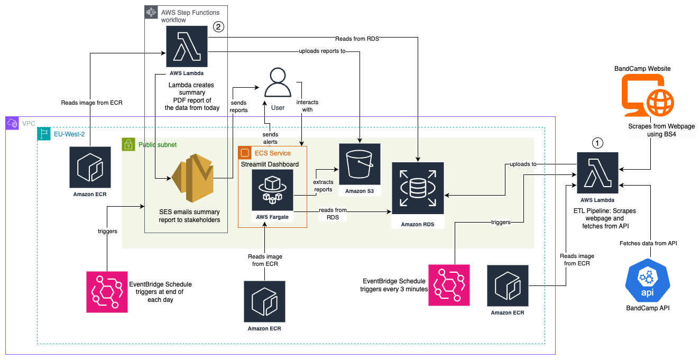
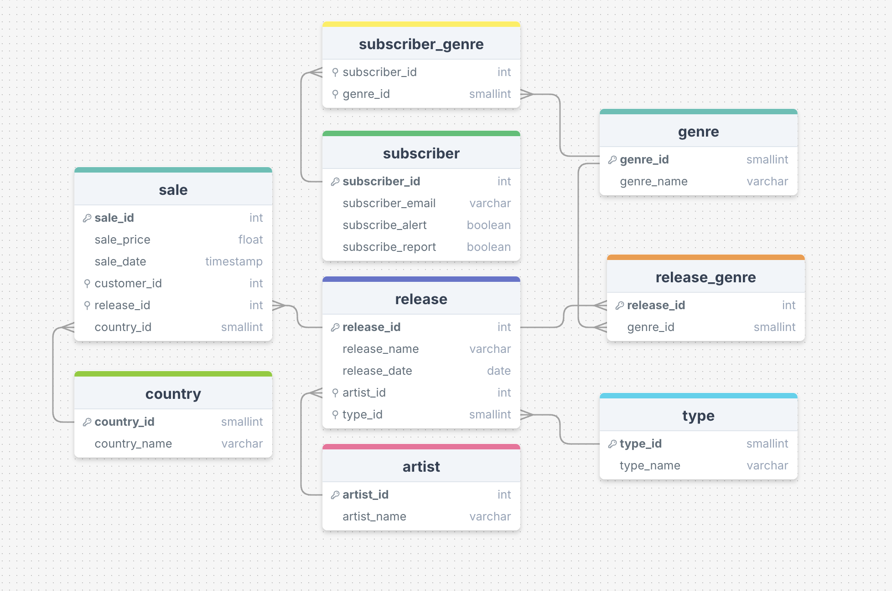

# **Band Camp Tracker Project**

---

## **Overview**

The **Band Camp Tracker** is a data-driven project designed to provide insights into trending genres and artists in the music industry. By addressing the challenges of identifying trends in a fragmented and complex market, this project helps uncover what genres are popular and which artists are gaining traction before they become mainstream.

The solution regularly collects and processes sales and genre data from the BandCamp platform, presenting it via a dashboard and automated reports. 

---

## **Architecture**

The architecture of this project consists of:
1. **Data Extraction**: Using the BandCamp API and web scraping with Beautiful Soup to gather data.
2. **Data Transformation**: Cleaning and standardising the extracted data.
3. **Data Storage**: Storing all data in Amazon RDS for querying and reporting.
4. **Dashboard**: A Streamlit-based dashboard hosted on ECS for real-time data visualisation.
5. **Automation**: EventBridge triggers and Lambda functions to schedule and manage workflows.

Refer to the **[Architecture Diagram](./docs/architecture-diagram.png)** for a detailed view of the system design.

---

## **Dashboard and Wireframe Design**

### **Dashboard Overview**
The interactive Streamlit dashboard provides:
- **Real-time insights** into sales trends by genre, artist, and region.
- **Dynamic filtering options** for detailed analysis.
- **Visualisations** such as bar charts, line graphs, and heatmaps for intuitive exploration.

### **Wireframe Design**
The dashboard wireframe provides a visual blueprint of its layout and features.  
Refer to the **[Wireframe Design](./docs/wireframe-design.png)** for details.

---

## **Project Files**

- **ETL Pipelines**:
  - [Pipeline README](./pipeline/README.md)  
    Includes information on the extract, transform, load scripts, and the main ETL pipeline.
  - **Files**:
    - `extract.py`: Data extraction script.
    - `transform.py`: Data transformation script.
    - `load_to_rds.py`: Data loading script.
    - `main_pipeline.py`: Main script orchestrating the entire ETL pipeline.

- **Streamlit Dashboard**:
  - [Dashboard README](./dashboard/README.md)  
    Documentation for the Streamlit application and its configuration.
  - **Files**:
    - `app.py`: Streamlit app for visualising data.

- **Terraform Infrastructure**:
  - [Terraform README](./infrastructure/README.md)  
    Details the AWS setup scripts for RDS, ECS, EventBridge, and Lambda.
  - **Files**:
    - `main.tf`: Main Terraform configuration file.
    - `variables.tf`: Terraform variables.
    - `outputs.tf`: Terraform outputs.

- **Testing**:
  - [Tests README](./tests/README.md)  
    Provides details on running unit and integration tests for the project.
  - **Files**:
    - `test_extract.py`: Tests for the extract script.
    - `test_transform.py`: Tests for the transform script.
    - `test_load.py`: Tests for the load script.
    - `test_main_pipeline.py`: Tests for the main pipeline script.

- **Documentation**:
  - **Files**:
    - `architecture-diagram.png`: Architecture diagram.
    - `wireframe-design.png`: Dashboard wireframe design.
    - `erd.png`: Entity Relationship Diagram (ERD).

- **Docker Files**:
  - **Files**:
    - `Dockerfile`: Docker configuration for the ETL pipeline.
    - `docker-compose.yml`: Docker Compose setup for local development.

- **GitHub Workflows**:
  - **Files**:
    - `quality_check.yaml`: Workflow for testing and linting.
    - `deploy.yaml`: Workflow for deployment.

---

## **Planned Outputs**

1. **Dashboard**:
    Real-time visualisation of sales and trends.
    Dynamic filters to explore genres, artists, and regions.

2. **PDF Reports**:
    Automated daily summaries of key metrics.

3. **Alerts**:
    Notifications for trending genres and artists.

---

## **Setup Instructions**

### **Prerequisites**
- Python 3.11
- Docker
- AWS CLI
- Terraform (for infrastructure setup)

### **Steps**

1. **Clone the Repository**:
    ```bash
    git clone https://github.com/your-org/band-camp-tracker.git
    cd band-camp-tracker
    ```

2. **Install Dependencies**:
    ```bash
    pip install -r requirements.txt
    ```

3. **Set Up Environment Variables**:
   Create a `.env` file in the project root with the following content:
   ```env
   API_KEY=<Your BandCamp API Key>
   DB_USER=<Your RDS Username>
   DB_PASSWORD=<Your RDS Password>
   DB_HOST=<Your RDS Endpoint>
   DB_NAME=<Database Name>
   ```

4. **Run the ETL Pipeline**:
    ```bash
    python3 pipeline/main_pipeline.py
    ```

5. **Deploy Dashboard**: 
    Follow the instructions in the Dashboard Repository.

---

## **Testing**

Run Unit Tests:
    ```bash
    pytest tests/
    ```
Run Lint Checks:
    ```bash
    pylint pipeline/
    ```
---

## **Documentation**

1. **Architecture Diagram**:  
   The high-level system design is visualised below:  
   

2. **Entity-Relationship Diagram (ERD)**:  
   The database schema and relationships are detailed here:  
   

3. **Wireframe Design**:  
   The layout and functionality of the dashboard are illustrated in the wireframe design:  
   

---
## **Contributors**

This project was made possible thanks to the collaborative efforts of the following team members:

| Name             | Role             | GitHub Profile                                 |
|------------------|------------------|-----------------------------------------------|
| Ellie Bradley     | Project Manager  | [GitHub](https://github.com/ebradley12)       |
| Emily Curtis      | Architect        | [GitHub](https://github.com/emily-curtis)     |
| Luke Harris       | Architect        | [GitHub](https://github.com/lukieh2014)       |
| Ben Trzcinski     | QA Engineer      | [GitHub](https://github.com/bentrzcinski)     |
| Gabriel Nsiah     | QA Engineer      | [GitHub](https://github.com/GabrielNsiah)     |

---

## Assumptions
- 

---

## Future Improvements
- 